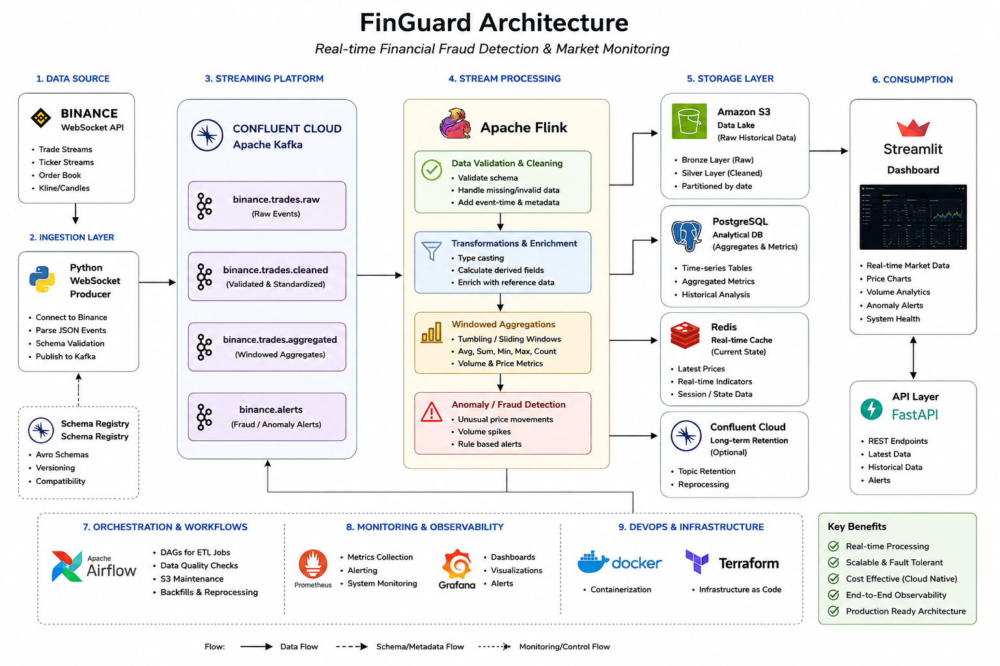

# Real-Time Cryptocurrency Streaming Data Platform

A modern real-time streaming data platform built using Apache Kafka, Python, Amazon S3, AWS Glue, Amazon Athena, and Power BI.

The platform ingests live cryptocurrency market data from the Binance WebSocket API, streams it through Apache Kafka, processes and validates the data in real time, stores it in an Amazon S3 Data Lake using partitioned Parquet files, automatically catalogs the data with AWS Glue Crawlers, and delivers analytics-ready datasets for querying with Amazon Athena and visualization in Power BI.

Designed using modern data engineering best practices, this project demonstrates event-driven architecture, real-time data streaming, cloud-native data lake design, and scalable analytics.


# Architecture

## Architecture Diagram




# Technology Stack

- Apache Kafka
- Python
- Binance WebSocket API
- Docker
- Amazon S3
- AWS Glue Crawlers
- AWS Glue Data Catalog
- Amazon Athena
- Power BI
- Parquet
- SQL
- AWS IAM
- Git & GitHub


# Project Scope

The platform focuses on streaming and analyzing live cryptocurrency market data, including:

- Live trade events
- Cryptocurrency prices
- Trade volumes
- Market activity
- Timestamped transaction data

This project simulates a production-grade real-time financial data pipeline using an event-driven architecture.


# Key Features

- Real-Time Data Streaming
- Event-Driven Architecture
- Apache Kafka Producer and Consumer
- Binance WebSocket Integration
- Amazon S3 Data Lake
- Partitioned Parquet Storage
- Automated Schema Discovery with AWS Glue Crawlers
- AWS Glue Data Catalog Integration
- SQL Analytics with Amazon Athena
- Interactive Power BI Dashboards
- Data Validation and Quality Checks
- Dead Letter Queue (DLQ) for Invalid Records
- Scalable Cloud-Native Architecture
- Cost-Optimized Storage and Querying


# Data Flow

```
Binance WebSocket API
        │
        ▼
Python Kafka Producer
        │
        ▼
Apache Kafka Topics
        │
        ▼
Python Kafka Consumer
        │
        ▼
Data Validation & Transformation
        │
        ▼
Amazon S3 (Partitioned Parquet Data Lake)
        │
        ▼
AWS Glue Crawlers
        │
        ▼
AWS Glue Data Catalog
        │
        ▼
Amazon Athena
        │
        ▼
Power BI Dashboards
```


# Architecture Highlights

- Streams live cryptocurrency market data using the Binance WebSocket API.
- Processes high-throughput events with Apache Kafka.
- Stores optimized Parquet datasets in Amazon S3 using partitioned folders.
- Automatically discovers schemas and creates tables using AWS Glue Crawlers.
- Queries data serverlessly with Amazon Athena.
- Builds interactive dashboards in Power BI.
- Implements data validation and error handling to improve data quality.
- Demonstrates a scalable, production-style streaming data architecture suitable for real-time analytics.
